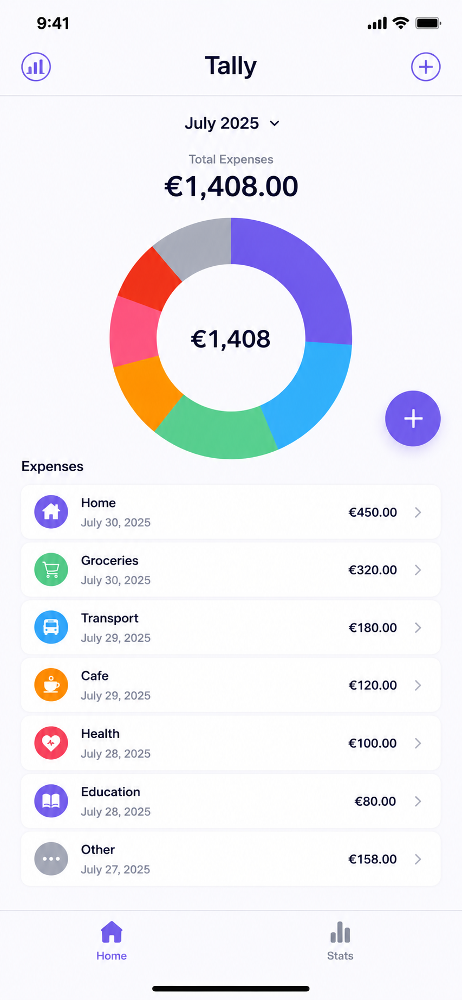
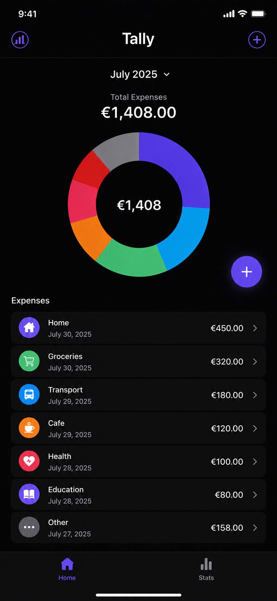

# tally

An expense manager app made with Flutter.

## Screenshots

> **Note:** The screenshots shown above are **AI-generated placeholder mockups** and do **not** represent the current implementation of the application. They are included to showcase the intended design and user experience while development is still in progress. They will be replaced with actual app screenshots as features are completed.

## Setup

Run the following commands:

1) `https://github.com/maryfallah/tally.git` to clone this repository
2) `flutter pub get` in the project root dirctory to install the required dependencies.

## Features

- 🎨 Clean Material 3 UI
- 📈 Interactive expense pie chart
- 💸 Expense categorization
- 🌙 Light & Dark mode
- ⚡ Smooth animations

##  Tech Stack

- Flutter
- Dart
- Material 3
- fl_chart

## ⚠️ Disclaimer

This project is a personal learning and portfolio project.

The UI and overall design were inspired by an existing expense tracking application (Money manager & expenses) available on the Google Play Store. The design has been recreated solely for educational purposes to practice Flutter development, application architecture, and UI implementation. This project is **not** affiliated with, endorsed by, or intended to replicate the original application beyond serving as a learning exercise.

